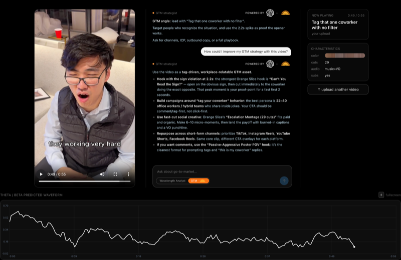
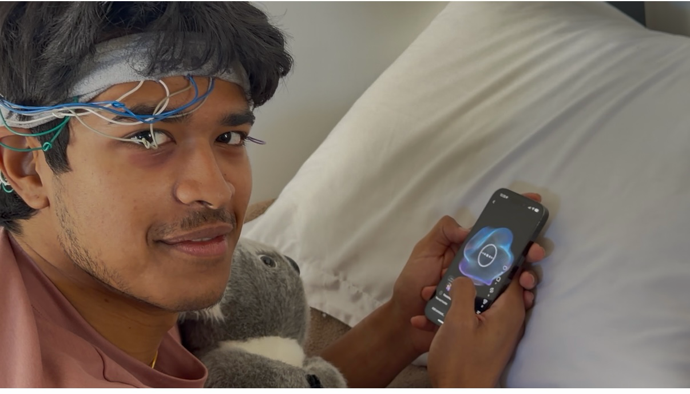
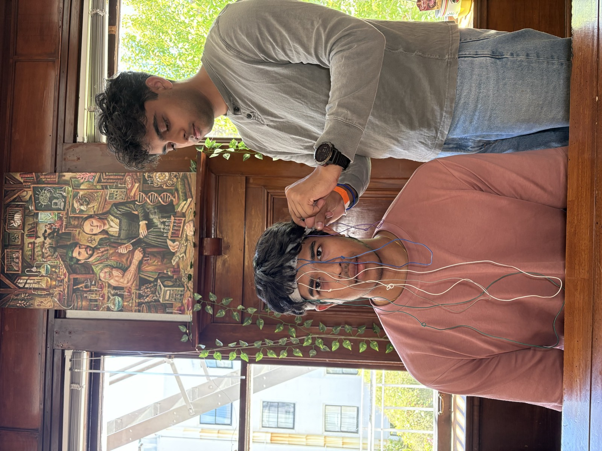

# Wavelength

> Wavelength reads engagement straight off your brain — wear an EEG, watch short-form videos, and know which ones will go viral before you spend a cent on ads.

### 🎥 Demo

| ▶ Watch the 60s demo | 🌐 Try the live app |
|:---:|:---:|
| [](REPLACE_WITH_DEMO_VIDEO_URL) | [](https://wavelength-teal.vercel.app/live) |
| **[▶ Watch the 60s demo](REPLACE_WITH_DEMO_VIDEO_URL)** | **[🌐 wavelength-teal.vercel.app/live](https://wavelength-teal.vercel.app/live)** |

<!-- TODO: paste a YouTube/Loom demo link in both REPLACE_WITH_DEMO_VIDEO_URL spots above.
     The demo video is the single highest-value link in the README. -->

## The Problem

Advertisers and creators have **no way to know if content will land before they spend on it** — they ship, wait, and read the analytics after the money is gone. Wavelength reads engagement *directly off your brain*: a rising theta/beta ratio = rising interest. Watch clips with an EEG on, and we tell you which ones will go viral — and *why* — before launch.

## How it works

```
EEG headset ──┐
              ├─▶  per-exposure sync  ──▶  theta/beta interest curve  ──┐
short-form  ──┘    (event join keys)                                    │
  video feed                                                            ▼
       │                                                      virality / retention model
       └──▶  video features (SigLIP image + CLAP audio,                 │
             cuts, on-screen text, pacing)  ───────────────────────────┤
                                                                        ▼
                                            OpenAI "decode": WHY it spiked
                                            Orange Slice: GTM brief (hook + persona)
```

1. **Capture** — viewer puts on the EEG headset, enters an access code, consents (18+), fills a short demographics form, then watches a gated Reels-style feed. The session is silently timed.
2. **Log** — every frame of interaction (dwell, watch %, scrubs, likes/saves) is buffered and tagged with EEG sync IDs + timestamps, so the brain signal aligns to the exact video exposure.
3. **Decode** — the theta/beta ratio becomes a per-clip interest curve; the model maps video features → predicted interest, retention, and virality.
4. **Act** — OpenAI explains *why* a clip spiked in plain language; Orange Slice turns the spike into a go-to-market brief (the hook that works + who to target).

## Notable features

- **Brain-aligned analytics** — every interaction event carries EEG join keys (`eegSyncId`, `sessionId`, `clientEpochMs`, `exposureId`), so EEG and behavior line up to the millisecond in post.
- **Predicted interest waveform** — a live theta/beta curve overlaid on the clip, with the peak moment flagged.
- **AI GTM strategist** — chat that turns an interest spike into hooks, target persona, and channel strategy (OpenAI + Orange Slice).
- **Real stimulus pipeline** — scrapes Instagram Reels, selects a balanced stimulus set, and withholds public performance labels for honest post-study validation.
- **Runs fully offline / in mock mode** — local access codes, bundled clips, SQLite + admin dashboard, no cloud required.
- **Cross-platform** — one Expo codebase for iOS / Android / web, plus a Next.js analyst dashboard.

## Why we built this

Ad spend on short-form video is mostly guesswork — you launch, burn budget, and *then* learn what resonated. Surveys and focus groups are slow and people lie (or don't know why they liked something). The signal we actually want — genuine, pre-conscious interest — is already in the brain. We built Wavelength to read it directly and move content testing from *after* the spend to *before* it.

## Screenshots

**Live analysis — predicted theta/beta interest waveform + GTM strategist (OpenAI + Orange Slice):**


| Collecting EEG data while watching | Fitting the EEG rig before a session |
|:---:|:---:|
|  |  |

## Tech Stack

| Layer | Tech |
|---|---|
| **Mobile app** | Expo (React Native + Web), `expo-router`, `expo-video`, TypeScript |
| **Web app** | Next.js 14, React 18, Tailwind CSS |
| **API server** | Hono + SQLite (`better-sqlite3`), runs fully local |
| **ML / model** | Python · PyTorch · scikit-learn · SigLIP (image) + CLAP (audio) embeddings · OpenCV |
| **Signal** | Synthetic + live EEG (theta/beta interest curves), per-exposure event join keys |

## Sponsor Tracks

| Sponsor | How we use it |
|---|---|
| **OpenAI** | Neuro-marketing "decode" chat — streams a plain-language explanation of *why* a clip spiked interest from its characteristics + EEG curve (`frontend/lib/openai.ts`). |
| **Orange Slice** | GTM integration — turns an EEG interest spike into a go-to-market brief (hooks + target persona) and stores it as a reusable Orange Slice skill (`scripts/orangeslice/gtm.mjs`). |

## Structure

```
wavelength/
│
├── app/              Expo mobile app — gated Reels-style feed
│   ├── index.tsx       access code → consent → demographics
│   ├── feed.tsx        paged looping video viewer
│   └── complete.tsx    silent-timed session summary
│
├── components/       VideoFeedItem · ActionRail · OptionsSheet
├── lib/              session state machine · buffered event logger · API client
│
├── frontend/         Next.js web demo (live / log / report screens)
│   ├── app/            live-eeg · waveform · replay · report routes
│   ├── components/     waveforms · movie-barcode · GTM panel
│   └── lib/            OpenAI decode · predict · EEG types
│
├── server/           local Node API (Hono + SQLite)
│   └── src/            routes · D1-compatible store · derived metrics + /admin
│
├── model/            content → EEG-interest → virality pipeline
│   ├── extract_*      SigLIP/CLAP embeddings + video features
│   ├── train_*        interest / retention / virality models
│   └── run_sponsor_report.py   AI-UGC retention report
│
├── contracts/        shared schemas (EEG sample + video) + mocks
└── scripts/          IG stimulus scraper · video analysis · Orange Slice GTM
```

## Run it

```bash
npm install
npm run web        # browser (fastest iteration)
npm run ios        # iOS simulator
npm run server     # local API + SQLite + admin dashboard (http://localhost:8787)
```

Runs **fully in mock mode** (local access codes `DEMO` / `QUICK2`, bundled sample clips) until `EXPO_PUBLIC_API_BASE` is set.

## Challenges we ran into

- **Aligning EEG to video, to the millisecond.** Brain signal and on-screen events live on different clocks; we had to stamp every interaction event with shared sync IDs and elapsed time so the curves actually line up in post.
- **Noisy, low-channel EEG.** Consumer EEG is messy and motion-prone — we lean on the theta/beta ratio rather than raw voltages, and smooth before deriving the interest curve.
- **Almost no labeled "viral" data.** There's no clean dataset of clip → virality, so we scrape real Reels, withhold their public metrics, and use pretrained SigLIP/CLAP embeddings + transfer learning instead of training from scratch.
- **Two apps, one weekend.** Building an Expo capture app *and* a Next.js analyst dashboard in parallel meant locking a shared schema (`contracts/`) early so the frontend and model never blocked each other.

## Status & metrics

<!-- TODO: drop in real session counts / model numbers here before judging, e.g.
     "Collected N sessions across M participants · model predicts interest with R² = …" -->

| Piece | Status |
|---|---|
| 5-screen capture flow + gating + consent + demographics | ✅ built |
| Paged looping feed + brain-aligned event capture | ✅ built |
| Local API + SQLite + admin dashboard + CSV export | ✅ built |
| EEG → interest curve + virality/retention model | ✅ built (synthetic + live EEG) |
| OpenAI decode + Orange Slice GTM brief | ✅ built |
| Real Instagram stimulus pipeline | ✅ built |

---

**Team:** Holly (frontend) · Devan (model + backend) · Yuva (pitch) — *YC Growth Hackathon*
